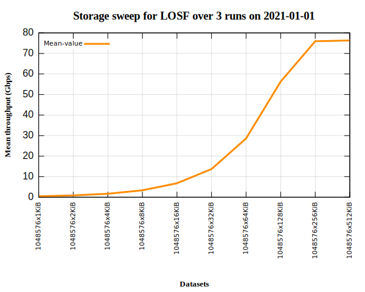
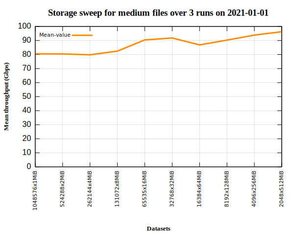
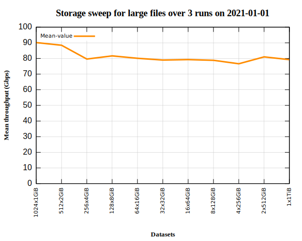
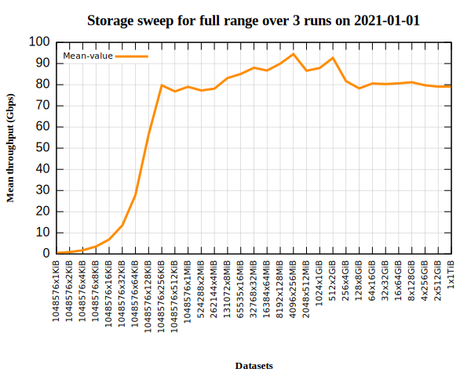
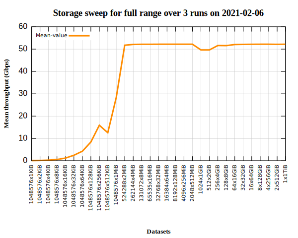
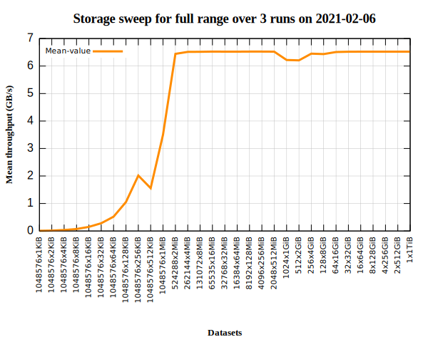

## December 25, 2020

Chin Fang <`fangchin[at]zettar.com`>, Palo Alto, California, U.S.A  
[Programming is Gardening, not
Engineering](https://www.artima.com/intv/garden.html) 

# Table of contents

<b>(click to expand)</b>

=================

   * [Introduction](#introduction)
   * [Requirements](#requirements)
   * [Layout and content](#layout-and-content)
   * [Goals and possible uses](#goals-and-possible-uses)
      * [Primary goal of each wrapper and the main use](#primary-goal-of-each-wrapper-and-the-main-use)
         * [mtelbencho.sh](#mtelbenchosh)
         * [graph_sweep.sh](#graph_sweepsh)
		 * [dgen.sh](#dgensh)
      * [Other uses](#other-uses)
   * [Motivation](#motivation)
   * [A brief overview of storage benchmarking](#a-brief-overview-of-storage-benchmarking)
      * [A typical goal](#a-typical-goal)
      * [How it should be done](#how-it-should-be-done)
      * [Properly understand storage benchmarking](#properly-understand-storage-benchmarking)
      * [Carry out your own storage benchmarking](#carry-out-your-own-storage-benchmarking)
   * [Future evolution](#future-evolution)
   * [Acknowledgments](#acknowledgments)
   * [Epilogue](#epilogue)

# Introduction

This directory contains three `bash` scripts:

1. **`graph_sweep.sh`** is a wrapper script of `mtelbencho.sh` and
   [`gnuplot`](http://www.gnuplot.info).  Its main purpose is to make
   the graphing of storage sweeps a push-button operation.  Once it's
   installed, type `graph_sweep.sh -h` for more info.
2. **`mtelbencho.sh`** (*mt: multiple test*) is a wrapper script for
   `elbencho`. Once it's installed, type `mtelbencho.sh -h` for more
   info.
3. **`dgen.sh`** (*data generator*) is also a wrapper script for
   `elbencho`. Once it's installed, type `dgen.sh -h` for more info.

`elbencho` is a modern, distributed, fast, storage space efficient,
and easy to use storage benchmarking application. There is no need to
study many pages of documentation or search the Internet up and down
looking for tutorials, hoping to get some useful tips.  Merely run:

`elbencho --help-all | less` 

and read carefully. With a bit of practice, one should acquire enough
proficiency to use `elbencho` for real work.  This is how I learned
`elbencho`.

Nevertheless, it should be helpful to see how this versatile program
is used in real production/test environment.  `mtelbencho.sh` provides
a simple, production grade, useful, and extensible example.
`graph_sweep.sh` enables you to graph the obtained results in a push
button manner.  `dgen.sh` enables you to quickly and flexibly generate
hyperscale test datasets, where the term "hyperscale datasets" is
defined in [the next section](#requirements).

Before proceeding, you may wish to browse the
**[`QUICKSTART.md`](QUICKSTART.md)** first.

[Back to top](#page_top)

# Requirements

1. There must be two TB (1TB=1000000000000 bytes) available to conduct
   a sweep.  Note that only hyperscale datasets are used, where the
   term "hyperscale dataset" is defined as a dataset that has overall
   size >= 1TB (terabyte), or contains >= 1 million files, or
   both. **Note**, *you don't need to generate test data ahead of the
   time*!
2. `elbencho` version 1.6.x or later must be installed and available
   in the `root`'s `$PATH`.
3. `mtelbencho.sh`, `graph_sweep.sh`, and `dgen.sh` are installed
   together with `elbencho` RPM or DEB packages, likewise, when the
   `make install` is issued.  Please note that you need to be `root`
   to actually run them.  The key reason is that `mtelbencho.sh` and
   `dgen.sh` run `elbencho` with its `--dropcache` option, which
   demands `root` privilege.  You can run the dry-run mode `-n`
   without being a `root` however.
   
Note also that your storage must be reasonably fast (*i.e. capable of
attaining a write throughput level >= 10Gbps with appropriately sized
files*) to use the storage sweep tools. *In this age of exponentially
and fast growing data, using slow storage is really no longer a
cost-saving approach, it's actually money and time wasting instead*!

As a reference, on a [Zettar
testbed](https://youtube.com/watch?v=5qTpGg57p_o), using any one of
the two nodes (*each has a Linux software RAID 0 based on 8xNVMe
SSDs - Intel DC P3700 1.6TB U.2*), the following provides single-run
(`-N 1`) sweep timing information:

|**Range**  | Test duration |
|-----------|---------------|
|**LOSF**   | 35m:58s       |
|**Medium** | 33m:29s       |
|**Large**  | 31m:3s        |
|**Full**   | 1h:40m:13s    |

If your storage takes much longer, e.g. 33 hours to finish a sweep
for, e.g. the LOSF range, please heed the above advice.

[Back to top](#page_top)

# Layout and content

This directory contains 

1. `graph_sweep.sh` 
2. `mtelbencho.sh` 
3. `dgen.sh`
4. `sw_tests` subdirectory.  Please review the
   [`README_sw_tests.md`](sw_tests/README_sw_tests.md) in this subdirectory.

# Goals and possible uses

## Primary goal of each wrapper and the main use

### mtelbencho.sh 
A storage sweep (*described more in the **[Motivation](#motivation)**
and **[A brief overview of storage
benchmarking](#a-brief-overview-of-storage-benchmarking)** sections
below*) is a simple and effective way to learn about *the current*
performance and characteristics of a storage service. Such a sweep
should be carried out by any IT professional responsible for an
organization's storage, especially a new deployment.  The results
provide an overview of the storage in question agnostic about
application / use case.

The foremost goal of `mtelbencho.sh` is to simplify the already easy
`elbencho` usage even more for carrying out a storage sweep over a
wide range of file sizes. As implemented, it does so by default
sweeping from **1KiB** to **1TiB**, incremented in power-of-two file
sizes.  Once installed, please type `$ mtelbencho.sh -h` on the
command line for more details.  We also recommend you consulting the
[`QUICKSTART.md`](QUICKSTART.md).

[Back to top](#page_top)

### graph_sweep.sh

Nevertheless, often times it is much desirable to have the numerical
results plotted in simple to understand form. This is where the
`graph_sweep.sh` comes in. Please see figures below, produced with the
`graph_sweep.sh`'s `-p` (*push button plotting option*). You may wish
to consult the [`QUICKSTART.md`](QUICKSTART.md) again.

|      | |
|-----------------------------------------------|-------------------------------------------------|
||     |

Note that 
1. Due to the gradual changes of the performance characteristics of
   SSDs, the shape of the graphs above may change over time.  More
   below in the next subsection.
2. This pair of tools is the outcome of [an ESnet/Zettar
collaboration](https://www.es.net/assets/Uploads/zettar-zx-dtn-report.pdf)
on [High-Performance Data Movement Services –
DTNaaS](https://www.youtube.com/watch?v=LIQxIZVAxks).  In this space,
using bps is the norm. Furthermore, modern storage tends to be
networked; in the networking world, bps has also been the unit to
use. Thus the default output unit is Gbps. Nevertheless, the
`graph_sweep.sh` has a `-T` (traditional) option which enables GB/s as
a storage oriented output unit.
3. The storage sweep tools are meant to be applied to reasonably fast
   storage. As such, **Gbps** and **GB/s** are used.  No smaller units are
   planned.
   
The following shows the two sweep plots of using bps and Bps. They
were generated on [a Zettar
testbed](https://youtube.com/watch?v=5qTpGg57p_o), using the following
two commands:
1. `# graph_sweep.sh -s /var/local/zettar/sweep -b 16 -o /var/tmp/full/1 -p -v`
1. `# graph_sweep.sh -s /var/local/zettar/sweep -b 16 -o /var/tmp/full/2 -p -v -T`

|      | |
|-----------------------------------------------|-------------------------------------------------|

### dgen.sh 

This wrapper is the outcome of the [NVIDIA SC21 Virtual Theater talk
"Accelerating At-Scale AI Data
Migration"](https://resources.nvidia.com/en-us-supercomputing-2021-virtual-theater/ai-data-migration)
The wrapper also serves to show that other than for storage
benchmarking, `elbencho` can have some novel uses! For example, it can
be used to generate various test datasets very flexibly. `dgen.sh`
only shows some possibilities.

[Back to top](#page_top)

## Other uses

Using the two wrappers and `elbencho`, one can conveniently accomplish
the following:

1. Gain a good understanding of a file storage system in
   service.
2. Select a file system from several candidates, e.g. EXT4, BRTFS, XFS, ZFS.
3. Pick the most performant candidate from several distributed,
   scale-out file storage service candidates.
4. Select the most appropriate storage devices, from multiple
   choices, for a given file storage service.
5. Help evaluate the impacts of a storage tuning approach.
6. Prepare (aka condition) a large number of new SSDs using the two
   wrappers together with `elbencho`, recalling it's a distributed
   application.
7. Monitor the characteristics of a batch of SSDs in production over
   time, either visually or numerically.  Note that SSDs, except
   [Intel
   Optane](https://www.intel.com/content/www/us/en/architecture-and-technology/optane-technology/optane-enterprise-storage.html),
   tend to change their performance characteristics over time.  Please
   see [The Why and How of SSD Performance
   Benchmarking](https://www.snia.org/educational-library/why-and-how-ssd-performance-benchmarking-2011)
   for a more in-depth discussion.  A quick glance of the six full
   sweep plots  should make it evident that
   although they are similar, but not identical.
8. Generate various test datasets flexibly.

Many other uses are possible. It's up to one's creativity and
imagination.

[Back to top](#page_top)

# Motivation

My professional focus and specialty is at-scale data movement, such as
for large-scale AI/ML/DL training.  Since 2015, my company, [Zettar
Inc.](https://zettar.com/) has been engaged to support the ambitious
data movement requirements of [Linac Coherent Light Source II
(LCLS-II)](https://lcls.slac.stanford.edu/lcls-ii/design-and-performance),
a premier U.S. Department of Energy (DOE)'s Exascale Computing
preparation project.  As a result, my team and I have become
intimately familiar with the DOE's co-design principle: *integrated
consideration of storage, computing, networking, and highly
concurrent, scale-out data mover software for optimal data movement
performance*.

We also learned that when undertaking any serious moving data at scale
and speed effort, *the first step* should always be gaining a good
understanding of the storage system's I/O throughput and
characteristics, typically by storage benchmarking.

While collaborating with the DOE's Energy Sciences Network (ESnet) in
2020, documented in [Zettar zx Evaluation for ESnet
DTNs](https://www.es.net/assets/Uploads/zettar-zx-dtn-report.pdf), one
challenge was the file size range and the number of files in a dataset
that needed to be considered -- there was simply not a single storage
benchmarking tool that we knew of could meet our needs.  The timely
appearance of `elbencho` was really a serendipity as it met our
requirements perfectly.  As a result, the ESnet/Zettar project
concluded both timely and successfully.

Believing what we learned and did during the project could be helpful
to others, I decided to rewrite and consolidate the various test
scripts that I wrote for the project into a pair of `bash` wrappers.

In 2021, NVIDIA invited Zettar to collaborate with DataDirect Networks
(DDN) for a [Supercomputing 2021 (SC21) Virtual Theater solution
showcase](https://www.hpcwire.com/off-the-wire/zettar-to-showcase-accelerating-at-scale-ai-data-migration-at-sc21/). The
production-ready, fully optimized solution is for accelerating
at-scale AI data migration. An endeavor that's fast gaining importance
as large-scale AI/ML/DL traing sessions need more and more data that
must be efficiently and conveniently migrated over to the GPU
clusters. But an often overlooked factor is that time needed for
moving data to the ingestion storage for AI processing often takes
signficant percentage of the overall session time! During the
preparation, other than `mtelbencho.sh` and `graph_sweep.sh`, I
recognize the need to generate test datasets conveniently, thus I
wrote `dgen.sh` leveraging some little known `elbencho`'s
capabilities.

[Back to top](#page_top)

# A brief overview of storage benchmarking

The views and opinions expressed below are for serious data processing
tasks. Also, they reflect my background in high-performance computing
(HPC) at the U.S. DOE national lab level.  Nevertheless, I anticipate
the information to be useful to large distributed data-intensive
enterprises and institutions.

## A typical goal

It is to understand the impact of storage's I/O throughput and
characteristics to one or more selected target application(s).

[Back to top](#page_top)

## How it should be done

1. Always configure the benchmark as closely as possible to the target
   application (e.g. a database)'s I/O patterns and storage interactions.
2. If the target application is a host-oriented one, such as a typical
   database application, then the storage benchmarking should be
   carried out on a single **storage client host** (*identical in
   hardware spec and configuration to the one that **is** intended to run
   said application*).
3. If the target application is a cluster application running on e.g.
   5 cluster nodes, then the storage benchmarking should be carried
   out concurrently on five **storage client hosts** (*identical in
   hardware spec and configuration to the ones that **are** intended to
   run said application*).
4. In general, such benchmarking should be carried out over storage
   interconnects, e.g. InfiniBand or Ethernet (RoCE likely
   configured).

[Back to top](#page_top)

## Properly understand storage benchmarking

1. A storage benchmark is not aimed to give you a single metric for
   any storage service. A single metric for storage never exists -
   file storage benchmark results always depend on file size
   histograms and the number of files. How you run it also matters!
2. It is also not aimed to get the highest value from a storage
   service than any other application. The author of a storage
   benchmark cannot know every application out there and be so
   magical.
3. The main value of a storage benchmark is to enable you to easily
   estimate the attainable read/write throughput available to a target
   application. The application could be running in one or more
   storage clients.

Furthermore, we often read that a storage service can provide,
e.g. 1TB/s throughput :grin:.

This number is meaningless because the lack of info about the
following, among the others:

1. How was the number obtained? What is the topology of the test
   setup?  How about the benchmark software?
2. How is the benchmark software configured? 
3. What kind of datasets was used for the measurements? e.g. their
   respective histogram?
4. How long and how many times did the benchmark take to run?
5. What is the interconnect connecting the storage clients for
   benchmarking and the storage service?
6. What is the hardware spec of the storage clients running the
   benchmark? Their tuning level?
7. Is a production setup used or a purposely constructed one for show
   only?

[Back to top](#page_top)

## Carry out your own storage benchmarking

So, we recommend using `graph_sweep.sh` and `mtelbencho.sh` to carry
out storage sweeps in your environment and obtain your own numbers,
which you can trust.  `elbencho` together with the two bash wrappers
empower you to do so conveniently.
  
[Back to top](#page_top)
  
# Future evolution

`elbencho` is a distributed storage benchmark for file systems and
block devices with support for GPUs.  It is far more capable than the
the first two wrappers cover.  In addition, the pair doesn't directly
handle the benchmarking of scale-out storage.  Although coupled with
something like [Ansible](https://www.ansible.com) and `elbencho`'s
service mode (see `elbencho --help-all`), it can be done.  Future
improvement and evolution are definitely possible.

Sven and other contributors have been adding new features and
functionalities to `elbencho` from time to time.  Perhaps in the
future, when opportunities arises, I will create a read benchmark
wrapper and introduce the ability to sweep AWS S3 compatible object
storage. `dgen.ch` can be made even more flexible as well.  You are
also encouraged to try to consider your own contributions along such
directions.

[Back to top](#page_top)

# Acknowledgments

* **Sven Breuner**, for creating the excellent `elbencho` and
  enhancing it rapidly, his friendship, and many stimulating
  discussions over the years.
* **Sandy Wambold**, for her friendship and English help.  If the
  content of this README.md is readable, please credit her.
* **Igor Soloviov**, for his patient help any time I become rusted in
  software development skills.
* **Oleskandr Nazarenko**, for his code reviews and helpful critiques.

# Epilogue

I hope you enjoy using the three modest wrappers as much as I did creating
them!

[Back to top](#page_top)
